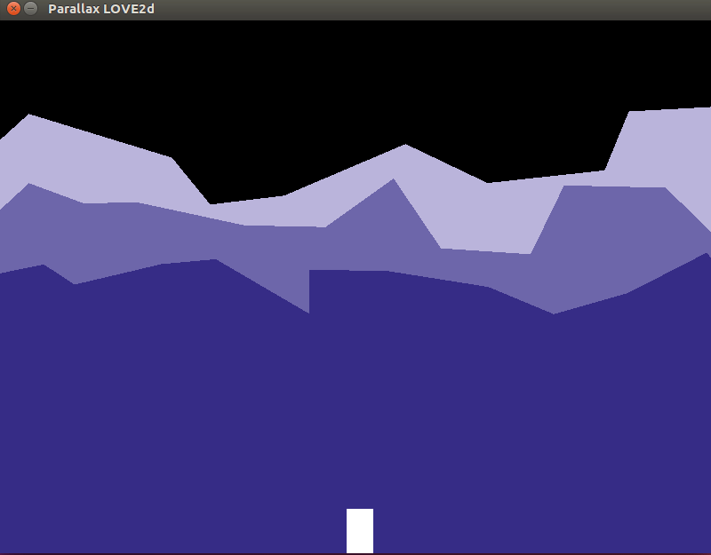

# A parallax_love2d

Simple demo to test parallax using LOVE2D and LUA.


## Getting Started

### Prerequisites

This project require LUA and LOVE2D.

In linux you can install with
```
sudo apt install lua5.3 love
```

In other system, please check the official sites:
* [LUA](https://www.lua.org/download.html)
* [LOVE2D](https://love2d.org/#download)

### Installing

No installing needed. Just download this repo.
```
git clone https://github.com/Blackmane/parallax_love2d
```

### Run

Simple run
```
love parallax_love2d/
```

## Gif




