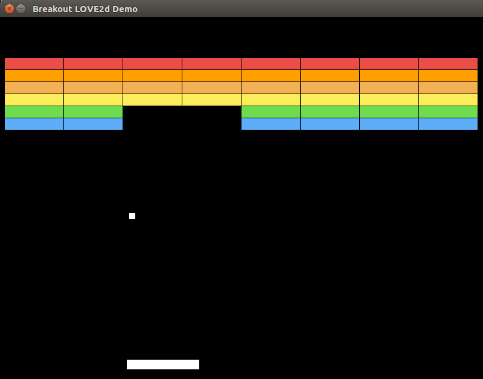

# A breakout_love2d_demo

Simple breakout game just to try to use LOVE2D and LUA.



## Getting Started

### Prerequisites

This project require LUA and LOVE2D.

In linux you can install with
```
sudo apt install lua5.3 love
```

In other system, please check the official sites:
* [LUA](https://www.lua.org/download.html)
* [LOVE2D](https://love2d.org/#download)

### Installing

No installing needed. Just download this repo.
```
git clone https://github.com/Blackmane/breakout_love2d_demo
```

### Run

Simple run
```
love breakout_love2d_demo/
```

## Acknowledgments

* Inspired by [Gabriele's talk for GDG PISA](https://www.youtube.com/watch?v=f_0LVro9mhg)


